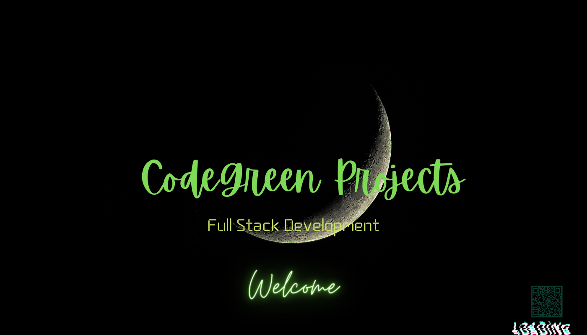

  

 

  

  

&nbsp;

---

  

 

| 🟠 FIELD | 📋 DATA |
|:---:|:---|
| 🪪 **Name** | Sterling Green |
| 🎮 **Street Name** | ohWhale515 |
| 📍 **Territory** | East Side · Delaware |
| 🏢 **Set** | Quasar Seed LLC |
| 🟢 **Status** | `ACTIVE` — Grove Street, Home... |
| 🎯 **Mission** | Merge DevOps · Software · Automation · Media · Design |
| 🧠 **Rep** | Building is KEY |

---

  

 

<table>
<tr>
<td valign="top" width="50%">

<h3>🟢 CJ's Rep Sheet</h3>

💬 Ask about anything — <strong>Building is KEY</strong>  
🚗 I build systems, tools, automations, platforms &amp; visuals  
🏗️ DevOps · Cloud · Creative Tech · Branding · Dev  
⚡ Always in the game. Never slipping.  

<h3>📡 Hit Me On The Pager</h3>

📟 Personal — sterlinggreen515@gmail.com 
🏢 Business — codegreenprojects@gmail.com  

<h3>🎮 Skill Bars</h3>

 
 
 
 
 

</td>
<td valign="top" width="50%">

<h3>🔫 Weapon Loadout (Tech Stack)</h3>

| 🟠 SLOT | WEAPON |
|:---|:---|
| ☁️ **Cloud** | AWS · Azure |
| 🐳 **Heavy** | Docker · Kubernetes |
| 🐍 **Sidearm** | Python · JavaScript · PHP · C++ |
| ⚛️ **Melee** | React · HTML · CSS · Bootstrap |
| 🔧 **Backup** | Node.js · Django · Flask |
| 🗄️ **Stash** | PostgreSQL · MongoDB · MySQL · Redis |
| 🔁 **Throwable** | Git · Linux · Bash · Grafana · Kafka |
| 🎨 **Special** | Blender · Photoshop · Unity · Unreal |

 

<h3>🗺️ Territory Map</h3>

 
 

</td>
</tr>
</table>

---

  

 

  

---

  

 

<h4>☁️ CLOUD &amp; DEVOPS — Los Santos</h4>

 

<h4>💻 LANGUAGES &amp; FRAMEWORKS — San Fierro</h4>

 

<h4>🗄️ DATABASES &amp; DATA — Las Venturas</h4>

 

<h4>🧰 WORKFLOW — Grove Street HQ</h4>

 

<h4>🎨 CREATIVE — Madd Dogg's Mansion</h4>

---

  

 

  

  

---

  

 

  

<em>"You picked the wrong house, fool — but you found the right dev."</em>

---

  

 

<strong>Build bold. Build clean. Build useful.</strong>

  

<em>Turning ideas into systems, visuals, products, and real-world execution.</em> 
<em>Every line of code. Every design. Every deployment — intentional.</em>

  

---

  <h3>💚 Big ups. Thank you for the support.</h3>
  
Every view, follow, collab, and opportunity — that's Grove Street love right there.

 

